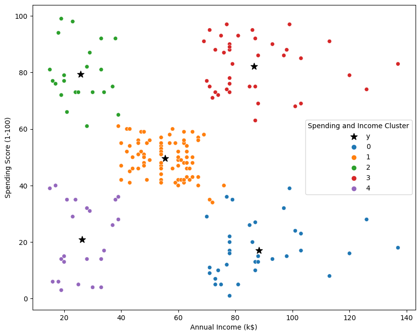

# Market Analytics - Customer Segmentation

## Table of Contents
* [About the Project](#about-the-project)
* [Prerequisites](#Prerequisites)
* [Getting Started](#getting-started)
* [Report](#report)
* [Future Work](#Future-Work)
* [Acknowledgements](#acknowledgements)

## About the Project
### Objective: Customer Segmentation (Market Analytics)
Here we are going to find different shoping groups based on demographics information(age,income) and shoping scores to find the target group for marketing campaigns.
#### Dataset
    - CustomerID	
    - Gender	
    - Age	
    - Annual Income (k$)	
    - Spending Score (1-100)

## Prerequisites
- Python(Pandas, Seaborn, Sklearn, matplotlib)

## Getting Started
To run this project you need to follow the following steps.

#### Prerequisites
These are the prerequisites you need to build this bot as well as run it.
- cmd:\ pip install numpy
- cmd:\ pip install pandas
- cmd:\ pip install matplotlib
- cmd:\ pip install seaborn

#### Extra SETUP
Create conda environment and create project in this environment
After installing requirements in above Modules LIST
You need python idle such as Jupyter notebook or spyder

## Report
- From the exploratory data analysis we can conclude that the following groups spend the most:
  - Female around age 20-40.
  - Female with annual income 50-75.
  - Female with spending score 35-60.
- Spending has a negative correlation with Age. Means older people spend less.
- Considering only **Annual Income**, by clustering data to 3 different clusters, the average income in the created clusters will be:
  - 66.7
  - 33.0
  - 99.8
- Considering both **Annual Income** and **Spending Score (1-100) **, by clustering data to 5 different clusters, we can see that the ideal clusters are:
  - 
- Our ideal cluster will be red color one. Because they have a high spending score and high annual income. 
Average age of red group is 32 years. 60% of this group are women. 
- Another ideal cluster will be green cluster. Even though they have low income, but they have a high spending score. 
Since the average age of this group is 25, our guess is they spend more on game and tech accessories or makeup and young-related items (purchase history must be analysed).
- We should look for ways to attract customers from these two groups and find their popular items.
- The campaign should be arranged around these two groups. By using customer id and digging more into their purchase history, 
We can find out what is the most desired products for them and design the campaign in a way that success rate be increased.

## Future Work
  By looking at the actual purchasing data, the following further analysis can be done:
  * After clustering the customers and finding hight potential buyers, we can extract the actual purchasing data and apply Product Recommendation to cutomers in the same cluster.
  * Predictive market basket analysis: to identify sets of item purchases (or events) that generally occur in sequence — something of interest to direct marketers, criminologists and many others.

## Acknowledgements
- [Numpy](#https://numpy.org/)
- [Pandas](#https://pandas.pydata.org/)
- [Matplotlib](#https://matplotlib.org/)
- [Seaborn](#https://seaborn.pydata.org/)
- [Jupyter Notebook](#jupyter.org)

